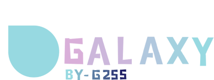

    

[官方网站](https://potatomc.us.ci:1024) 

LiquidBounce 是一款免费开源的、基于 Mixin 注入的黑客客户端，使用 Fabric API 开发，适用于 Minecraft。

## 问题反馈

如果你发现任何 Bug 或缺失的功能，可以通过在 [此处](https://github.com/CCBlueX/LiquidBounce/issues) 提交 Issue 来告知我们。

## 许可证

本项目遵循 [GNU 通用公共许可证 v3.0](https://www.gnu.org/licenses/gpl-3.0.en.html)。  
该许可证仅适用于此干净仓库中直接包含的源代码。在开发和编译过程中，可能会使用到我们未获得权利的额外源代码，此类代码不受 GPL 许可证保护。

对于不熟悉该许可证的人，以下是其主要内容的摘要。这并非法律建议，也不具有法律约束力。

*允许的行为：*

- 使用
- 分享
- 修改

*如果你决定使用本源代码中的任何代码：*

- **你必须公开你修改后的作品以及从本项目获取的源代码。这意味着你不允许在闭源（甚至混淆过的）应用程序中使用本项目的代码（即使是部分代码）。**
- **你修改后的应用程序也必须使用 GPL 许可证进行授权。**

## 搭建工作区

LiquidBounce 使用 Gradle 构建；你可以查看 [Gradle 官方网站](https://gradle.org/install/) 以确保正确安装。此外，项目还需要安装 [Node.js](https://nodejs.org) 以支持我们的 [主题](https://github.com/CCBlueX/LiquidBounce/tree/nextgen/src-theme)。

1. 使用命令 `git clone --recurse-submodules https://github.com/CCBlueX/LiquidBounce` 克隆仓库。
2. 进入本地仓库目录 (`cd LiquidBounce`)。
3. （可选）运行 `./gradlew genSources` 以获得更好的开发体验。
4. 在你偏好的 IDE 中，将该文件夹作为 Gradle 项目打开。
5. 运行客户端 (`./gradlew runClient`)。

## 附加库

### Mixins

Mixins 可用于在类加载前的运行时修改类。LiquidBounce 利用它将其代码注入 Minecraft 客户端。通过这种方式，我们不会分发任何 Mojang 受版权保护的代码。如果你想了解更多，可以查看其 [文档](https://docs.spongepowered.org/5.1.0/en/plugin/internals/mixins.html)。

## 贡献

我们非常感谢任何贡献。如果你想支持我们，请随意修改 LiquidBounce 的源代码并提交 Pull Request。

## 统计信息

## 出版信息
**G255**进行中文翻译和优化

**CCBlueX**  
Vahrenwalder Str. 269A
30179 汉诺威
德国

**所有者和内容负责人:** Marco Beyer
